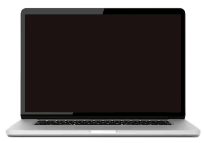

<h1 align="center">soy Mile!</h1>
<h3 align="center" fontSize="20">Frontend Developer</h3>

Soy desarrolladora Frontend Web y Mobile, me Encanta el Diseño y plasmarlo a código ❤️

 
    
    
     
     
     
     

- Todos mis proyectos están en [https://github.com/MileBarboza](github.com )

<h3 align="left">Skills:</h3>

 
   
  
  
  
  
  
   
   
  
   
   
   

<h3 align="left">Contáctame:</h3>

